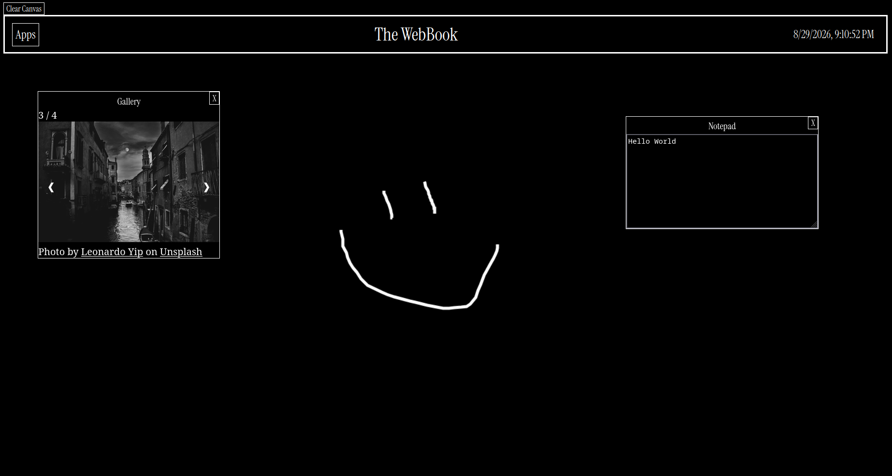

Web os for Hackclub Stardance Project.

Github Pages link: [link text] (https://shaninja11.github.io/The-Webbook)

A gothic Deathnote-inspired web os that features:
- Header with time and app menu
- Background that can be draw on
- Notepad window for writing text in
- Gallery window showing a slideshow of 4 gothic photos from unsplash

To run locally clone repo and run Entry.html in your browser.

Credits:
- Drawing script based of script by CodingSource - [Link text] (https://www.youtube.com/watch?v=0kGFU1UyQlg)
- Window-dragging and gallery slideshow function based of scripts provided by w3 school

!No AI was used - script.js was based off the above scripts (and edited by me) NOT AI!

Example image:

